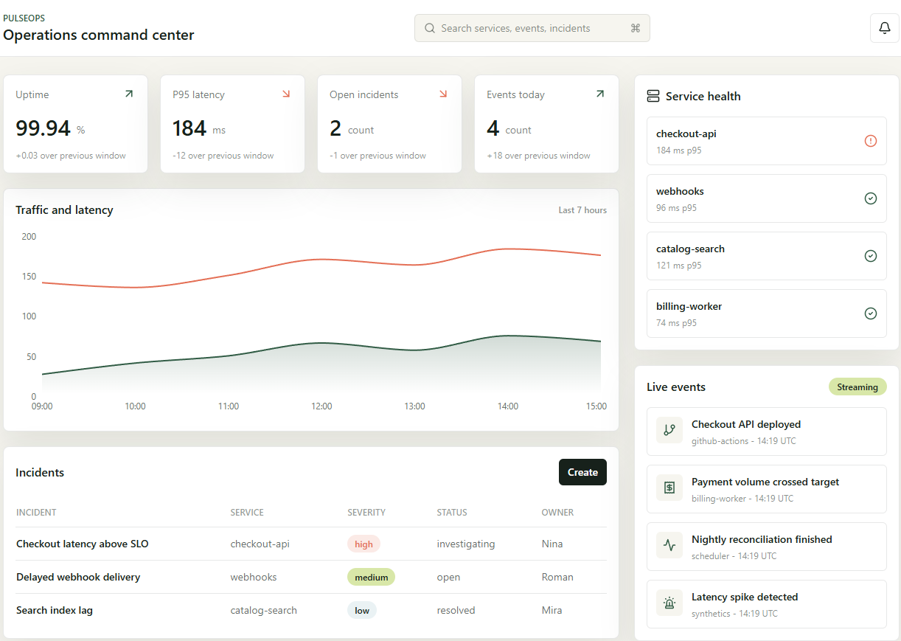

# Fullstack portfolio lab

This repository collects production-style portfolio projects built with different parts of my fullstack stack. Each project is intentionally structured like a real product, with documentation, local infrastructure and clear module boundaries.

## Projects

### PulseOps

Real-time operations dashboard for incidents, service health and business events.

Stack: Next.js, React, TypeScript, Fastify, Prisma, PostgreSQL, Redis, WebSocket, Docker, Turborepo.

Path: [`pulseops`](pulseops)

### Tenderly CRM

B2B tender and proposal management workspace for sales teams.

Stack: Laravel-style PHP API, Vue 3, Vite, TypeScript, MySQL, Redis, Tailwind CSS, Docker.

Path: [`tenderly-crm`](tenderly-crm)

